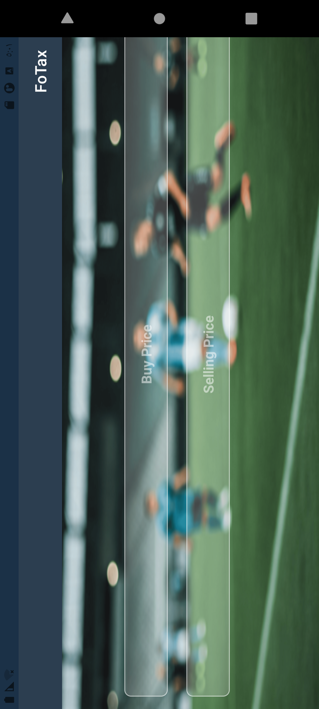

# FouTax

 تطبيق حساب الضريبة والأرباح لعبة FIFA

هذا التطبيق يساعد اللاعبين على حساب الأرباح والضرائب الناتجة عن بيع اللاعبين في لعبة FIFA. يدعم التطبيق جميع جولات Android ويعمل بشكل جيد على الأجهزة اللوحية بحجم 7 و 10 إنش.

 محتويات

 صور التطبيق:

 جوالات
 
  
  
  
  

 تابلت 7 إنش

 
  
  
  

 تابلت 10 إنش

 
  
  

الميزات

- حساب الأرباح من بيع اللاعبين.
- حساب الضرائب المستحقة.
- واجهة مستخدم بسيطة وسهلة الاستخدام.
- دعم الأجهزة الجديدة والشاشات المتعددة (7 و 10 إنش).

 المتطلبات

- أجهزة من API مستوى 27 إلى 35.

التثبيت

يمكنك تنزيل التطبيق من متجر Google Play:
[رابط متجر قوقل بلاي](https://play.google.com/store/apps/details?id=com.samialharbii.FoTax)
